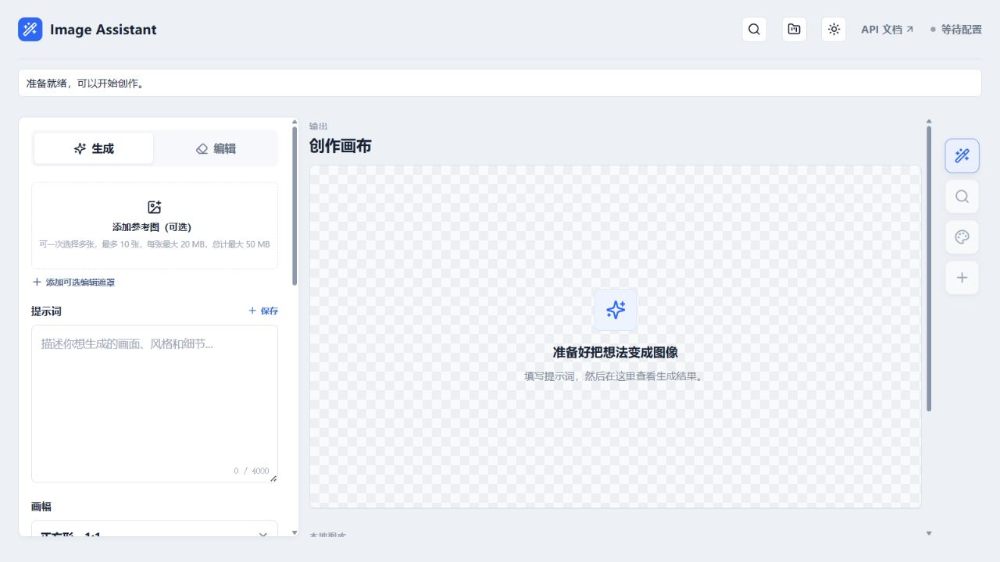
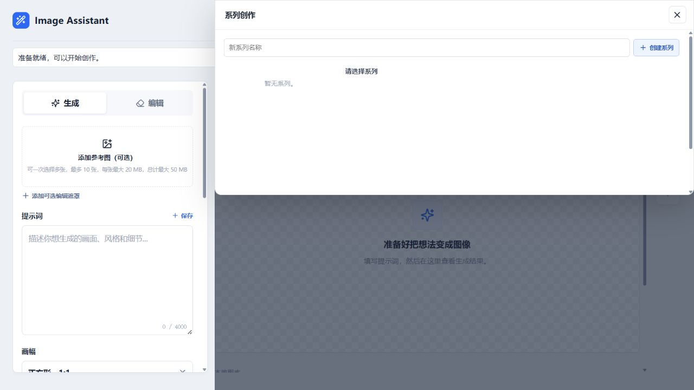

# Image Assistant

本地运行的 AI 图片创作工作台，支持文本生图、参考图创作、图片编辑和结构化提示词。



## 当前能力

- 文本生成图片、参考图生成、图片编辑和可选遮罩
- 1:1、16:9、9:16 三种画幅
- 生成结果自动保存到桌面 `Image-Assisant\YYYY-MM-DD`
- 图片合集按系列、节点分层展示，支持预览、下载和继续编辑
- 图片合集系列默认收起，可按系列和节点展开查看
- 顶部“提示词库”和“系列创作”抽屉
- 图片预览支持放大、缩小、重置、`Ctrl + 鼠标滚轮`缩放，以及按住鼠标左键拖动查看放大区域
- 从图片提取风格：分析构图、镜头、光影、色彩、材质和视觉风格
- 结构化提示词优化，可替换主体后再手动生成
- 本地风格模板，适合连续制作同一风格的图片
- 明亮、深色、暖灰三套主题

### 系列创作

可以创建系列和故事节点，也可以粘贴故事梗概自动拆分分镜，再按节点顺序批量生成。



## 快速启动

```powershell
Copy-Item .env.example .env
# 编辑 .env，填入 SUDOCODE_API_KEY
npm install
npm run dev
```

打开 <http://localhost:5173>。

开发模式会启动：

- 前端：`http://localhost:5173`
- 本地 API 代理：`http://localhost:3001`

首次打开时，可以点击页面顶部的钥匙图标进入“API 配置”，粘贴 API Key 后保存。密钥只写入项目根目录的 `.env` 文件，并且只允许本机请求；服务端不会把密钥返回给浏览器。

## 配置

`.env` 不会提交到 Git。最小配置：

```ini
SUDOCODE_API_KEY=你的密钥
```

也可以直接复制 `.env.example` 为 `.env` 后手动编辑。页面里的 API 配置只会更新 `SUDOCODE_API_KEY`，其他选项仍需在 `.env` 中配置。

可选配置：

```ini
SUDOCODE_BASE_URL=https://api.sudocode.chat/v1
SUDOCODE_TEXT_MODEL=gpt-4.1-mini
SUDOCODE_VISION_MODEL=gpt-4.1-mini
```

其中：

- `TEXT_MODEL` 用于生成灵感、故事分镜和提示词组合
- `VISION_MODEL` 用于从图片提取风格
- `MYSQL_*` 用于启用提示词库、系列、节点和图片元数据持久化

`SUDOCODE_VISION_MODEL` 必须填写支持图片输入的模型，否则“从图片提取风格”会提示“未配置 SUDOCODE_VISION_MODEL”。可使用当前 SudoCode 账户可用的视觉模型，例如 `gpt-4.1-mini`；如果该模型在账户中不可用，请替换为供应商控制台列出的其他视觉模型。

## 数据库说明

当前没有 MySQL 也可以使用图片生成、编辑、风格提取和本地风格模板。提示词库、系列管理和图片数据库合集会保留为空，连接 MySQL 后即可启用完整持久化能力。

图片文件始终保存到桌面目录，数据库只保存元数据。

如果本机已安装 MySQL，可在 `.env` 中取消注释并填写 `MYSQL_HOST`、`MYSQL_PORT`、`MYSQL_USER`、`MYSQL_PASSWORD` 和 `MYSQL_DATABASE`。应用启动时会尝试连接数据库；连接失败不会阻止不依赖数据库的图片生成和编辑功能。

## 常用命令

```powershell
npm run dev       # 前端 + 本地代理
npm run build     # 生产构建
npm test          # 全量测试
```

## 说明

“从图片提取风格”用于学习图片的视觉表达并替换成自己的内容，不是去水印功能，也不会直接修改原图。应用只通过本地代理访问上游 API，API Key 不会发送到浏览器端。
